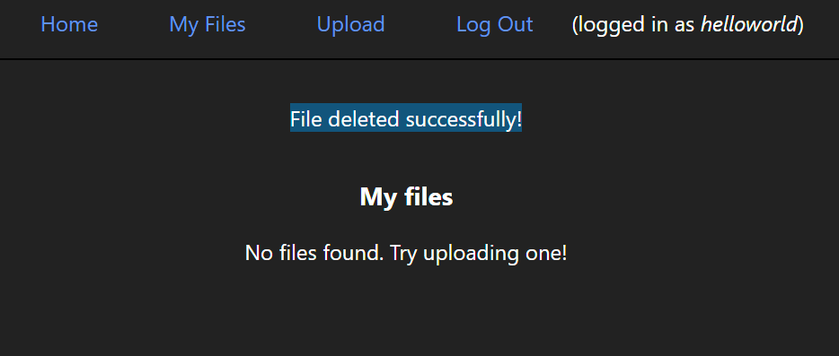

# Filelandia

Simple file upload service, made with Flask.

Users can sign up and log in – then upload, view, download and delete files.

## Usage

**WARNING**: development server and debug options in place.
1. ```python -m "venv" .env && source .env/bin/activate && pip install -r requirements.txt```

2. ```python run.py```

3. ```# Open 127.0.0.1:5000 in your browser```

## Stack
* Python (version `3.11`; application may be containerized soon™️).

* Flask & its extensions (Flask-Login, Flask-WTF, Flask-SQLAlchemy). 

* Jinja2 for templating & a little vanilla JavaScript on the front-end for fetching user's uploaded files list.

See `requirements.txt` for detailed versioning.

## Images

<hr>


<hr>


<hr>


<hr>


<hr>


<hr>


<hr>

